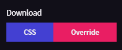

# Radzen Palette Creator

## Overview
Radzen Palette Maker is an innovative web-based tool designed for dynamic customization of UI color themes. It leverages the power of Blazor and CSS to offer a real-time, interactive platform where users can create, modify, and apply color themes across their applications. This tool is ideal for developers and designers aiming to craft distinct visual identities or ensure accessibility in their web projects.

## Features

- **Dynamic Theme Customization**: Interactively select and adjust base colors and generate corresponding color shades automatically.
- **Real-Time CSS Variable Management**: Modify CSS variables on-the-fly for immediate feedback on color adjustments.
- **Theme Persistence**: Switch between and maintain custom themes with ease, with preferences saved across browser sessions.
- **Interactive UI Components**: Utilize color pickers, dropdowns, and toggles to fine-tune and experiment with color schemes in a user-friendly environment.
- **Theme Export**: Download and integrate customized CSS directly into projects, streamlining design workflows.

## Installation

Clone the repository to your local machine using:

```bash
git clone https://github.com/yourusername/Radzen-Palette-Creator.git
```
Navigate into the project directory:

```bash
cd Radzen-Palette-Creator
```
Run the application using your preferred Blazor supported environment or deploy it to a web server to start customizing your themes.

## How to Use

Follow these simple steps to customize and apply color themes using Radzen Palette Maker:

1. **Launch the Application**

   Begin by launching Radzen Palette Creator. You'll be greeted with a user-friendly interface designed to make creating palettes simpler.

   <p align="center">
      <!-- Adjust the file name as necessary -->
   </p>

3. **Start Creating Your Palette**

   Start by making sure you've chosen the theme that you want by using the theme drop down.

   <p align="center">
      <!-- Adjust the file name as necessary -->
   </p>

   Use the provided tools and color pickers to start creating your desired color palette. Adjust colors and see the effects in real-time on the interface.

   <p align="center">
      <!-- Adjust the file name as necessary -->
   </p>

5. **Choose a Download Format: CSS or Override**

   Once you finished designing your theme its time to choose a download format
   - **CSS**: Select this option if you want to download a new version of the specific theme you're working on. This allows for maintaining varied palettes across different themes within your projects.
   - **Override**: Choose this option to apply your new palette across all themes you download. This ensures a consistent color scheme throughout your application, regardless of the theme.

     <p align="center">
        <!-- Adjust the file name as necessary -->
     </p>

6. **Click Download**

   Once you've finalized your palette and chosen your download format, click the 'Download' button of your choice to obtain your customized CSS or Override. Congratulations, you now have a tailor-made theme ready to integrate into your project!


## How to Implement

To integrate the themes you've created with Radzen Palette Maker into your Blazor applications, follow these steps:

1. **Download the Implementation Folder**
   
   Download the necessary files from the following link: 
   [Implementation Folder](https://download-directory.github.io/?url=https%3A%2F%2Fgithub.com%2FHennyBicks01%2FRadzenPaletteCreator%2Ftree%2Fmaster%2FImplementation)

2. **Unzip the Folder**
   
   Once downloaded, unzip the folder and:
   - Drag the `css` folder to your `wwwroot`.
   - And if youd like to have more than one theme
      - Move the `ThemeSwitcher.razor` to your `Pages` folder.
      - Place the `Theme.cs` in your `Models` folder.
      - Place the `theme.js` in your `wwwroot`.

3. **Correct the Namespace**
   
   Update the namespaces in both the `ThemeSwitcher.razor` and the `Theme.cs` Razor page to match your project's namespace.

4. **Update Project Layout**
   
   Depending on the version of .NET Blazor you are running:
   - For .NET 6, open `_Layout.cshtml`.
   - For .NET 7, open `_Host.cshtml`.
   - For .NET 8, open `App.razor`.

5. **Include CSS References**
    
   Add the following lines to the `<head>` section of your layout file or wherever you link your CSS files:

   ```html
   <link rel="stylesheet" href="~/css/bootstrap.min.css" />
   <link id="theme-css" rel="stylesheet" href="~/css/radzenCss/default.css">
   ```
   These lines ensure that Bootstrap, which is required by Radzen, is loaded, along with the default theme for Radzen located in the 'css' folder. You can change '"~/css/radzenCss/default.css"' to another theme file if      desired.

   Additionally if you want to include a Theme Switcher item later make sure to add

   ```html
   <script src="theme.js"></script>
   ```
   to where you call your scripts

6. **Setup Override (Override)**

   If you are using an Override instead of the custom CSS, add another line after the Radzen CSS to integrate your custom Override.

   ```html
   <link rel="stylesheet" href="~/css/theme.css">
   ```
   By placing this after the Radzen CSS, you will effectively override the palette of any theme you choose to use.

7. **Modify Default Theme and Manage Themes (Optional)**

   To change the default theme or manage available themes, navigate to `ThemeSwitcher.razor` and locate the following code:

   ```csharp
    private List<ThemeOption> themes = new List<ThemeOption>
    {
        new ThemeOption { Name = "Default", StylePath = "css/radzenCss/default.css" },
        new ThemeOption { Name = "Dark", StylePath = "css/radzenCss/dark.css" },
        new ThemeOption { Name = "Fluent", StylePath = "css/radzenCss/fluent.css" },
        new ThemeOption { Name = "Fluent Dark", StylePath = "css/radzenCss/fluent-dark.css" },
        new ThemeOption { Name = "Humanistic", StylePath = "css/radzenCss/humanistic.css" },
        new ThemeOption { Name = "Material", StylePath = "css/radzenCss/material.css" },
        new ThemeOption { Name = "Material Dark", StylePath = "css/radzenCss/material-dark.css" },
        new ThemeOption { Name = "Material3", StylePath = "css/radzenCss/material3.css" },
        new ThemeOption { Name = "Material3 Dark", StylePath = "css/radzenCss/material3-dark.css" },
        new ThemeOption { Name = "Software", StylePath = "css/radzenCss/software.css" },
        new ThemeOption { Name = "Standard", StylePath = "css/radzenCss/standard.css" },
        // Add more themes as needed
    };
   ```
   This section is where all the theme paths are stored. If you want to add or remove themes, modify the `themes` list accordingly. Remove entries you no longer need or add new ones by specifying the theme name and its corresponding CSS path. Remember to manage the actual CSS files in your `wwwroot/css/radzenCss` directory accordingly. 

   ```csharp
    private string currentThemePath = "css/radzenCss/default.css";
   ```
   Additionally, to change the default theme, update the `currentThemePath` string to point to a different CSS file.

8. **Importing Custom CSS (CSS)**

   If you have chosen the custom CSS files over the Override, simply drag and drop them from your downloads folder into the `wwwroot/css/radzenCss` directory. If asked to overwrite existing files, confirm the action to update the CSS files to your new custom css files. This will allow you to use your custom palettes in your application.

9. **Create a ThemeSwitcher Element**

   To integrate the theme switching functionality into any part of your Blazor application, simply add the `ThemeSwitcher` component into your Razor page. Place the following tag where you want the theme switcher to appear:

   ```razor
   <ThemeSwitcher />
   ```
   This tag will render the theme switcher UI, allowing users to switch themes dynamically from the webpage.

### Congratulations!
Congratulations on successfully integrating and customizing your themes with Radzen Palette Maker! Enjoy crafting unique and dynamic themes for your applications. Feel free to explore further customizations and extend the functionality as needed.

   

   

